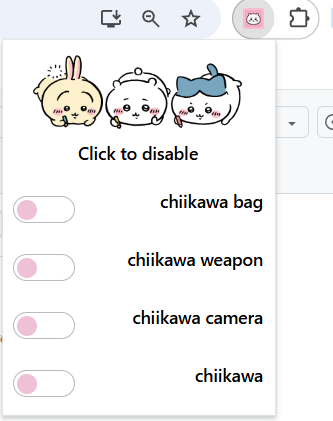
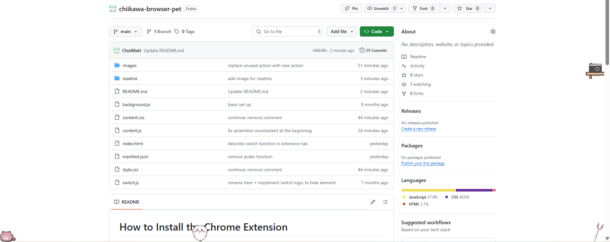

# How to Install the Chrome Extension

Follow these steps to install the Chrome extension from this repository:

## Step 1: Download the Repository

1. Click on the green **Code** button.
2. Select **Download ZIP**.
3. Save the ZIP file to your computer.

## Step 2: Unzip the File

1. Locate the downloaded ZIP file on your computer.
2. Right-click on the file and select **Extract All** (or use your preferred extraction method).
3. Choose a destination folder and extract the contents.

## Step 3: Load the Extension in Chrome

1. Open Google Chrome.
2. Go to the Extensions page by clicking on the three dots in the upper right corner, then selecting **More tools** > **Extensions**.
3. Enable **Developer mode** by toggling the switch in the top right corner.
4. Click on the **Load unpacked** button.
5. Navigate to the folder where you extracted the ZIP file and select it.
6. The extension should now be loaded and ready to use!

## How to Hide Specific Elements

1. Click on the extension icon in the Chrome toolbar.
2. A panel will open, displaying options to hide specific elements on the page.
3. Select the element you want to hide by checking the appropriate switch.
   
## How to Disable the Extension entirely

1. Open Google Chrome.
2. Go to the Extensions page by clicking on the three dots in the upper right corner, then selecting **More tools** > **Extensions**.
3. Find the extension you want to disable.
4. Toggle the switch next to the extension to disable it.

# Enjoy Your Time with Chiikawa

